# Sprite Gallery

<table>
  <tr>
    <td></td>
    <td></td>
    <td></td>
    <td></td>
    <td></td>
  </tr>
  <tr>
    <td></td>
    <td></td>
    <td></td>
    <td></td>
    <td></td>
  </tr>
  <tr>
    <td></td>
    <td>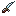</td>
    <td>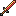</td>
    <td></td>
    <td></td>
  </tr>
  <tr>
    <td></td>
    <td></td>
    <td></td>
    <td></td>
    <td></td>
  </tr>
  <tr>
    <td></td>
    <td>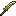</td>
    <td></td>
    <td></td>
    <td>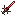</td>
  </tr>
  <tr>
    <td>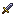</td>
    <td></td>
    <td></td>
    <td></td>
    <td></td>
  </tr>
  <tr>
    <td></td>
    <td></td>
    <td></td>
    <td>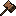</td>
    <td>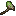</td>
  </tr>
  <tr>
    <td></td>
    <td></td>
    <td></td>
    <td></td>
    <td></td>
  </tr>
  <tr>
    <td></td>
    <td></td>
    <td></td>
    <td></td>
    <td></td>
  </tr>
  <tr>
    <td></td>
    <td>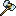</td>
    <td></td>
    <td></td>
    <td></td>
  </tr>
  <tr>
    <td></td>
    <td></td>
    <td></td>
    <td></td>
    <td>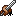</td>
  </tr>
  <tr>
    <td></td>
    <td>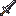</td>
    <td></td>
    <td>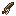</td>
    <td>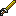</td>
  </tr>
  <tr>
    <td></td>
    <td>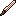</td>
    <td></td>
    <td>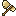</td>
    <td></td>
  </tr>
  <tr>
    <td>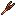</td>
    <td></td>
    <td></td>
    <td>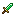</td>
    <td></td>
  </tr>
  <tr>
    <td>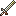</td>
    <td>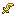</td>
    <td>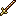</td>
    <td></td>
    <td></td>
  </tr>
  <tr>
    <td></td>
    <td></td>
    <td></td>
    <td>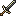</td>
    <td></td>
  </tr>
  <tr>
    <td></td>
    <td>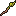</td>
    <td>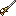</td>
    <td></td>
    <td></td>
  </tr>
  <tr>
    <td></td>
    <td></td>
    <td></td>
    <td></td>
    <td>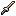</td>
  </tr>
  <tr>
    <td></td>
    <td></td>
    <td></td>
    <td></td>
    <td>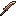</td>
  </tr>
  <tr>
    <td>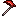</td>
    <td></td>
    <td>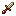</td>
    <td></td>
    <td></td>
  </tr>
  <tr>
    <td></td>
    <td>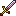</td>
    <td></td>
    <td></td>
    <td>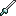</td>
  </tr>
  <tr>
    <td></td>
    <td></td>
    <td>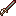</td>
    <td></td>
    <td></td>
  </tr>
  <tr>
    <td></td>
    <td></td>
    <td></td>
    <td></td>
    <td></td>
  </tr>
  <tr>
    <td></td>
    <td>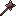</td>
    <td></td>
    <td></td>
    <td>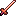</td>
  </tr>
  <tr>
    <td></td>
    <td></td>
    <td>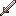</td>
    <td>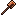</td>
    <td></td>
  </tr>
  <tr>
    <td></td>
    <td></td>
    <td></td>
    <td></td>
    <td>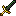</td>
  </tr>
  <tr>
    <td>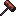</td>
    <td></td>
    <td></td>
    <td>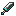</td>
    <td>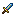</td>
  </tr>
  <tr>
    <td></td>
    <td></td>
    <td></td>
    <td></td>
    <td></td>
  </tr>
  <tr>
    <td>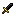</td>
    <td></td>
    <td></td>
    <td></td>
    <td>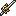</td>
  </tr>
  <tr>
    <td>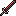</td>
    <td>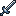</td>
    <td></td>
    <td></td>
    <td></td>
  </tr>
  <tr>
    <td></td>
    <td>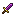</td>
    <td></td>
    <td>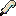</td>
    <td>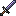</td>
  </tr>
  <tr>
    <td></td>
    <td></td>
    <td>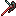</td>
    <td>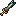</td>
    <td></td>
  </tr>
  <tr>
    <td>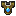</td>
    <td></td>
    <td>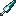</td>
    <td></td>
    <td></td>
  </tr>
  <tr>
    <td>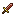</td>
    <td></td>
    <td></td>
    <td></td>
    <td>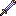</td>
  </tr>
  <tr>
    <td></td>
    <td></td>
    <td></td>
    <td></td>
    <td></td>
  </tr>
  <tr>
    <td></td>
    <td></td>
    <td></td>
    <td></td>
    <td></td>
  </tr>
  <tr>
    <td></td>
    <td></td>
    <td></td>
    <td></td>
    <td></td>
  </tr>
  <tr>
    <td></td>
    <td></td>
    <td></td>
    <td></td>
    <td></td>
  </tr>
  <tr>
    <td></td>
    <td></td>
    <td></td>
    <td></td>
    <td></td>
  </tr>
  <tr>
    <td></td>
    <td></td>
    <td></td>
    <td></td>
    <td></td>
  </tr>
  <tr>
    <td></td>
    <td></td>
    <td></td>
    <td></td>
    <td></td>
  </tr>
  <tr>
    <td></td>
    <td></td>
    <td></td>
    <td></td>
    <td></td>
  </tr>
  <tr>
    <td></td>
    <td></td>
    <td></td>
    <td></td>
    <td></td>
  </tr>
  <tr>
    <td></td>
    <td></td>
    <td></td>
    <td></td>
    <td></td>
  </tr>
  <tr>
    <td></td>
    <td></td>
    <td></td>
    <td></td>
    <td></td>
  </tr>
  <tr>
    <td></td>
    <td></td>
    <td></td>
    <td></td>
  </tr>
</table>
